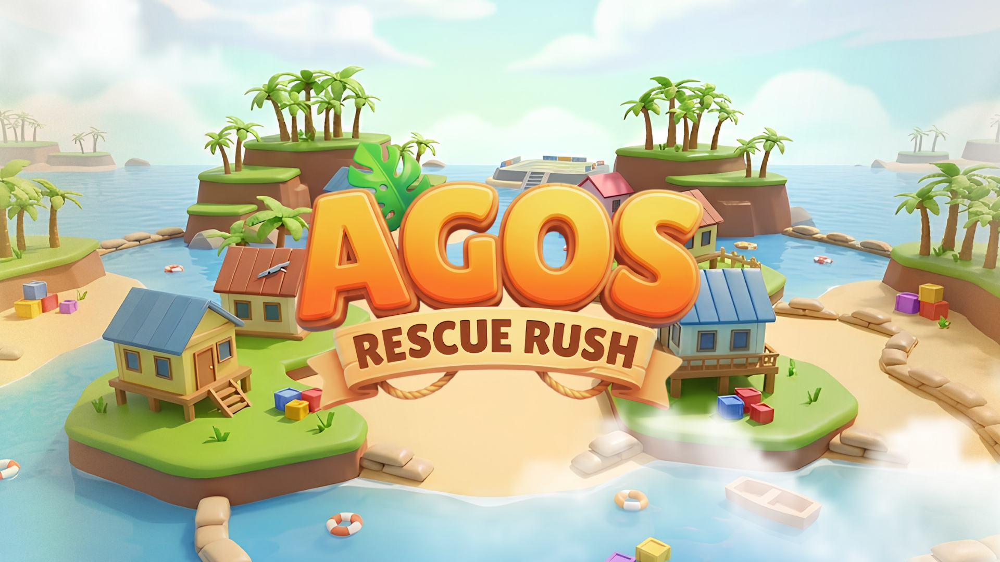

# AGOS: Rescue Rush

AGOS: Rescue Rush is a Godot disaster-response game prototype about Filipino community rescue during severe flooding. Players navigate a flooded barangay/suburban environment, help stranded residents, move supplies, avoid hazards, and aim for a strong rescue score in a short competitive PVE run.

## Project Overview

- **Engine:** Godot 4
- **Genre:** Competitive PVE rescue / time-attack prototype
- **Theme:** Disaster Risk Reduction and Management, climate change, Filipino flood rescue
- **Target Demo:** A readable 3-5 minute gameplay demo with scoring and leaderboard-ready structure

## Intended Gameplay Loop

1. Start the mission.
2. Read the short disaster briefing.
3. Navigate the flooded map.
4. Rescue stranded residents.
5. Deliver supplies and evacuees to safety.
6. Avoid debris, electric hazards, blocked paths, and strong currents.
7. Finish the mission and review the score/results.

## Running the Project

1. Install Godot 4.x.
2. Open Godot and import this folder as a project.
3. Open `project.godot`.
4. Run the project from the editor.

The repository currently includes game scenes, scripts, map assets, mesh libraries, shaders, UI assets, and the TerraBrush addon used for terrain/map work.

## Repository Notes

- Large generated/imported assets are committed only when needed by the demo.
- `GameAssets/Shapeforms Audio Free Sound Effects.zip` is intentionally ignored because it is over GitHub's normal file-size limit. Use Git LFS or a separate asset delivery method before adding that archive.
- Asset ownership and licenses are tracked in [CREDITS.md](./CREDITS.md). Any source marked as needing confirmation should be verified before final submission or public release.

## Current Direction

The intended competition direction is a compact, judge-readable PVE time-attack rescue experience with clear scoring, results, and replay value. Keep new work focused on playable demo clarity before expanding scope.
